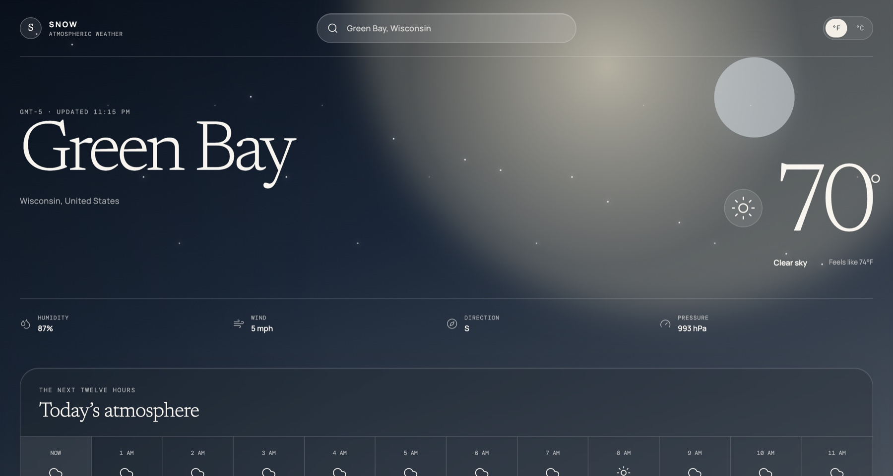

# Snow

[](https://github.com/jollyzachary/snow-weather/actions/workflows/ci.yml)

Snow is an atmospheric weather instrument built with SvelteKit, TypeScript,
and Go. It presents current conditions, hourly changes, a seven-day outlook,
air quality, visibility, and daylight information in one responsive interface.



Weather conditions drive the scene behind the forecast. Clear skies produce a
soft solar bloom; rain, snow, clouds, fog, storms, and night conditions each
have their own restrained motion system. The interface honors reduced-motion
preferences.

## Features

- Searchable worldwide locations with keyboard navigation.
- Current conditions and twelve-hour temperature changes.
- Seven-day high, low, precipitation, and condition forecasts.
- Air quality, visibility, humidity, wind, pressure, sunrise, and sunset.
- Imperial and metric units stored locally on the device.
- Responsive layouts for desktop and mobile screens.
- Condition-aware atmospheric animation with reduced-motion support.
- No client-side API credentials or application-level personal-data storage.

## Design approach

Snow treats weather as an atmosphere rather than a collection of dashboard
widgets. The typography, light, contrast, and motion respond as one system while
the forecast remains easy to scan. The result is expressive without sacrificing
clarity, keyboard access, responsive behavior, or reduced-motion support.

The production architecture is intentionally compact: SvelteKit generates the
interface, Go embeds it, and the finished application runs as one service. This
keeps deployment simple and places external API access, validation, timeouts,
and caching behind a controlled server boundary.

## Architecture

```text
SvelteKit interface
        │
        ├── /api/locations ── Open-Meteo Geocoding
        │
        └── /api/weather ────┬─ Open-Meteo Forecast
                             └─ Open-Meteo Air Quality
                                      │
                               Go response cache
```

The browser talks only to the Go service. The service validates coordinates,
requests forecast and air-quality data concurrently, enforces timeouts, and
caches responses for ten minutes. Location searches are cached for twelve
hours.

The production build compiles the SvelteKit interface into `backend/static`.
Go embeds those files and serves the interface and API from one binary.

## Technology

- Svelte 5 and SvelteKit
- TypeScript and Vite
- Go standard library HTTP server
- Open-Meteo forecast, geocoding, and air-quality APIs

## Local development

Requirements:

- Node.js 22 or newer
- Go 1.24 or newer

Install the frontend dependencies:

```bash
npm install
```

Start the Go service:

```bash
go run ./backend
```

In a second terminal, start the SvelteKit development server:

```bash
npm run dev
```

Vite proxies `/api` requests to the Go service on port `8080`.

## Production build

```bash
npm run build
go build -o snow ./backend
./snow
```

Set `PORT` to change the default `8080` listener.

## API

### `GET /api/locations?q=lake`

Returns up to eight matching locations.

### `GET /api/weather?lat=43.0814&lon=-88.9118&units=imperial`

Returns a combined forecast and air-quality response. Supported unit systems
are `imperial` and `metric`.

### `GET /api/health`

Returns the service availability state.

## Data attribution

Forecast, geocoding, and air-quality data are provided by
[Open-Meteo](https://open-meteo.com/). Weather model availability and licensing
remain subject to Open-Meteo's terms.
